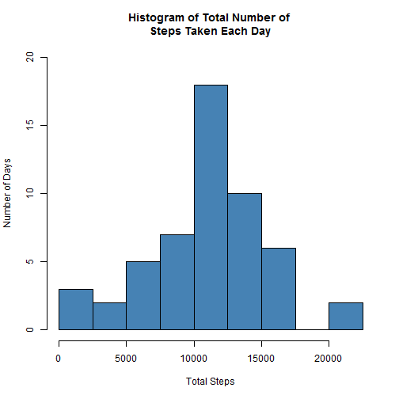
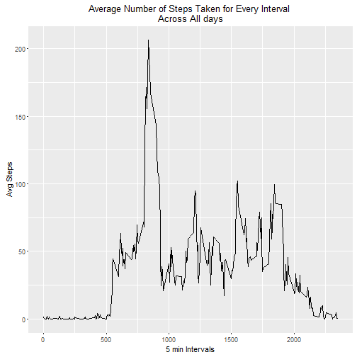
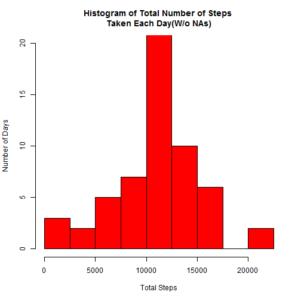
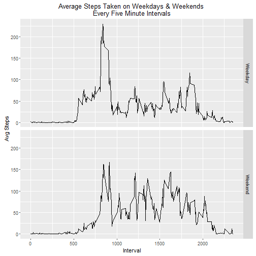

#Reading and Processing Data
Reading the activity file on setting the working directory to the file destination folder


```r
act<- read.csv("activity.csv")
```

```
## Warning in file(file, "rt"): cannot open file 'activity.csv': No such file
## or directory
```

```
## Error in file(file, "rt"): cannot open the connection
```
Tranforming dates to date elements

```r
act$date<- as.Date(as.character(act$date))
```
Creating by day vector and melting dataset to create daily sums of steps

```r
act$days<- as.Date(cut(act$date, breaks = "day"))
act_no_NAs<- na.omit(act)
bydays<- melt(act_no_NAs, id=c("days","date","interval"))
        sum_byday<-dcast(bydays, days~ variable, sum)
```

#Histogram of Total number of steps taken per day


```r
hist(sum_byday$steps, col="steelblue",
     breaks = c(0,2500, 5000, 7500, 10000,12500,15000,17500,20000,22500), 
     ylim = c(0,20),
     main = "Histogram of Total Number of \nSteps Taken Each Day",
     xlab = "Total Steps",
     ylab = "Number of Days")
```



Mean and Median of total number of steps taken each day

MEAN

```r
mean(sum_byday$steps)
```

```
## [1] 10766.19
```
MEDIAN

```r
median(sum_byday$steps)
```

```
## [1] 10765
```
#Time series plot of the average number of steps taken


```r
#averaging number of steps for every interval across all days
avg_byday<- dcast(bydays, interval~variable, mean)
#plotting time series for average steps taken for every interval
qplot(data = avg_byday, interval, steps, geom = "line",
      main = "Average Number of Steps Taken for Every Interval \nAcross All days",       ylab = "Avg Steps", xlab = "5 min Intervals")
```



Interval with maximum average steps

```r
avg_byday$interval[which(avg_byday$steps== max(avg_byday$steps))]
```

```
## [1] 835
```
Total Number of NAs

```r
sum(is.na(act$steps))
```

```
## [1] 2304
```

#Imputing Missing Values (NAs)

The process used the average of steps by the five minute intervals to impute missing values for a given interval.
a vector of means was created and the script checks within each interval whether ther is a missing value, when positive the script then gets the computed mean from the vector and impputes it for that interval.
I used ``` replace_na()``` from the dplyr package to do the imputation.


```r
act1<-as_tibble(act, validate = TRUE)
act2<-na.omit(act1)
act3<- melt(act2, id=c("days","date","interval"))
by_int<-dcast(act3, interval~ variable, mean)
x<-act1$steps
y<-act1$interval
i<-by_int$interval
s<-by_int$steps
intervals<- unique(i)
act5<- as_tibble(matrix(nrow = 0, ncol = 4))

for ( j in seq_along(intervals)){
        
        if(any(is.na(x[which(y==intervals[j])]))){
                m<-s[j]
                act4<-replace_na(act1[which(y==intervals[j]),],
                                 list(steps= m))
        }
        act5<- rbind(act5, act4)
        activity<- select(act5, steps, date, interval)
}
```
The ouput of this process is in activity, same dimension as the original data with no all NAs imputed

Dimension of data

```r
dim(activity)
```

```
## [1] 17568     3
```

Head of dataset

```r
head(activity)
```

```
## # A tibble: 6 × 3
##       steps       date interval
##       <dbl>     <date>    <int>
## 1  1.716981 2012-10-01        0
## 2  0.000000 2012-10-02        0
## 3  0.000000 2012-10-03        0
## 4 47.000000 2012-10-04        0
## 5  0.000000 2012-10-05        0
## 6  0.000000 2012-10-06        0
```

#Histogram of the total number of steps taken each day after missing values are Imputed


```r
bydays2<- melt(act5, id=c("days","date","interval"))
sum_byday2<-dcast(bydays2, days~ variable, sum)

#plotting histogram of steps per days without NAs
hist(sum_byday2$steps, col="red",
     breaks = c(0,2500, 5000, 7500, 10000,12500,15000,17500,20000,22500), 
     ylim = c(0,20),
     main = "Histogram of Total Number of Steps \nTaken Each Day(W/o NAs)",
     xlab = "Total Steps",
     ylab = "Number of Days")
```



Mean and Median of Total Steps per day after NAs imputed

MEAN

```r
mean(sum_byday2$steps)
```

```
## [1] 10766.19
```

MEDIAN

```r
median(sum_byday2$steps)
```

```
## [1] 10766.19
```
Only the medians differ. the Median of the second data set has increased and now equals its mean.


#Panel plot comparing the average number of steps taken per 5-minute interval across weekdays and weekends

```r
act5$days_fac<- weekdays(act5$days)
act5$days_fac<- as.factor(act5$days_fac)
levels(act5$days_fac)<-list(
        "Weekday"=c("Monday","Tuesday","Wednesday","Thursday","Friday"),
        "Weekend"=c("Saturday","Sunday"))
act6<- select(act5, interval,days_fac,steps)
act6<-melt(act5, id=c("interval","days_fac"))
```

```
## Warning: attributes are not identical across measure variables; they will
## be dropped
```

```r
act6<- dcast(act6, interval+days_fac~variable, mean)
qplot(interval, steps, data = act6, 
      facets = days_fac~.,
      geom = "line",
      xlab = "Interval", ylab = "Avg Steps",
      main = "Average Steps Taken on Weekdays & Weekends \nEvery Five Minute Intervals")
```



